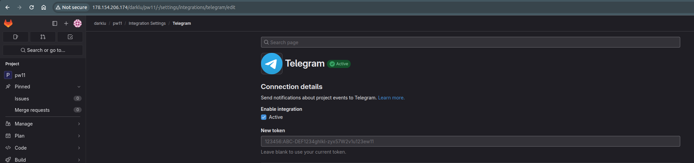
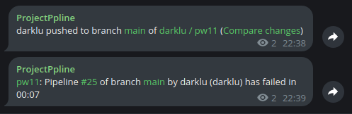
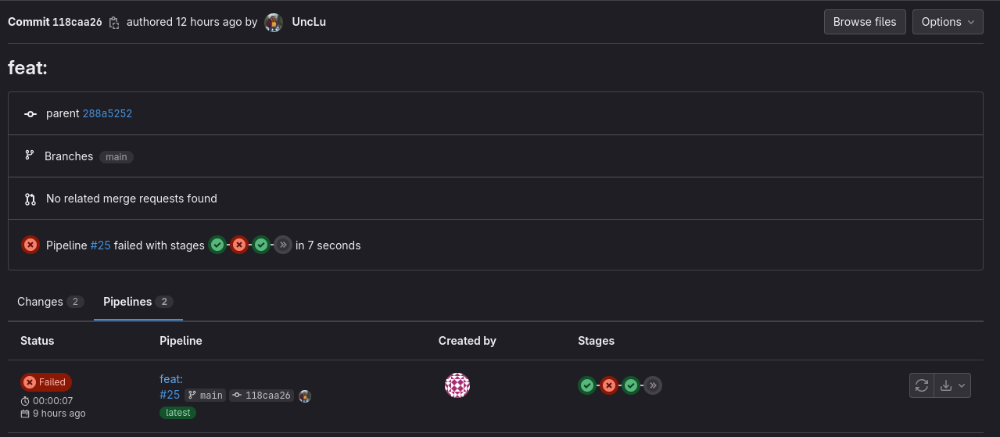
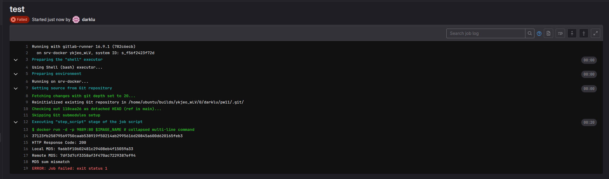
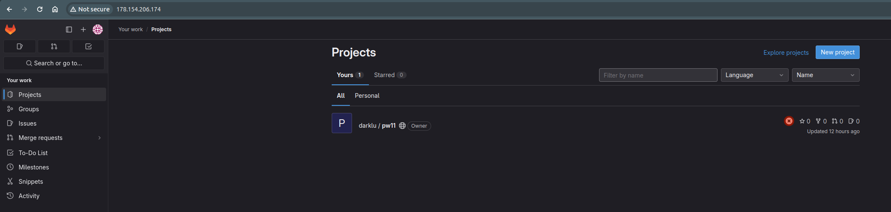

## Проектная работа 11
### Continuous Integration

:+1: Исходные файлы для проектной работы (*index.html*, *Dockerfile* *.gitlab-ci.yml*) размещены в папке [pw11](pw11)

#### Описание выполнения проектной работы

* в Я.Облаке создана виртуальная машина при помощи [Terraform](terraform) со следующими характеристиками: 8vCPU, 16GB, RAM, 100GB, HD
* Поднять на этой машине CI-сервер Gitlab при помощи [Ansible](ansible)
* Создан репозиторий [Gitlab - PW11](http://178.154.206.174/darklu/pw11)
* Настроен CI. Исходный код .gitlab-ci.yml

```
stages:
  - build-docker-img
  - test
  - cleanup

variables:
  DOCKER_TLS_CERTDIR: ""
  IMAGE_NAME: $CI_PROJECT_NAME:$CI_COMMIT_SHORT_SHA

services:
  - docker:dind

build-docker-img:
  stage: build-docker-img
  script:
    - docker build -t $IMAGE_NAME -f Dockerfile .

test:
  stage: test
  script:
    - |
        docker run -d -p 9889:80 $IMAGE_NAME
        sleep 20  # Подождем некоторое время, чтобы Nginx успел стартовать
        RESPONSE=$(curl -s -o /dev/null -w "%{http_code}" http://localhost:9889)
        echo "HTTP Response Code: $RESPONSE"
        test $RESPONSE -eq 200 || (echo "HTTP Response Code is not 200" && exit 1)
        LOCAL_MD5=$(md5sum index.html | awk '{print $1}')
        REMOTE_MD5=$(curl -s http://localhost:9889/index.html | md5sum | awk '{print $1}')
        echo "Local MD5: $LOCAL_MD5"
        echo "Remote MD5: $REMOTE_MD5"
        test "$LOCAL_MD5" = "$REMOTE_MD5" || (echo "MD5 sum mismatch" && exit 1)
  only:
    changes:
      - index.html

cleanup:
  stage: cleanup
  script:
    - docker stop $(docker ps -a -q)
    - docker rm $(docker ps -a -q)

```
##### Настроенна интеграция в настройках проекта



##### Исходный код Dockerfile

```
FROM nginx:latest
COPY index.html /usr/share/nginx/html/index.html
```

##### Для тестирования оповещния в исходном коде Dockerfile менял путь к index.html
```
FROM nginx:latest
COPY index.html /usr/share/nginx/index.html
```

##### Скрины джобов и оповещения в телеграм






##### Скрин созданного хоста Gitlab CI


<!-- BEGIN_TF_DOCS -->
<!-- END_TF_DOCS -->

---
